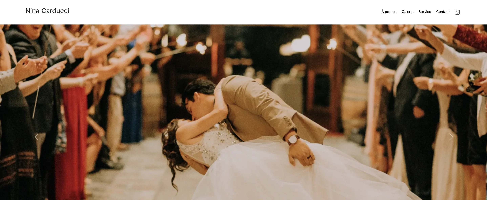
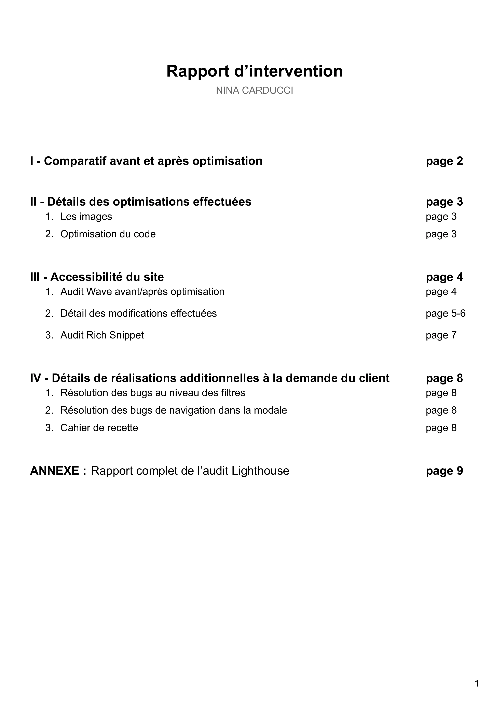
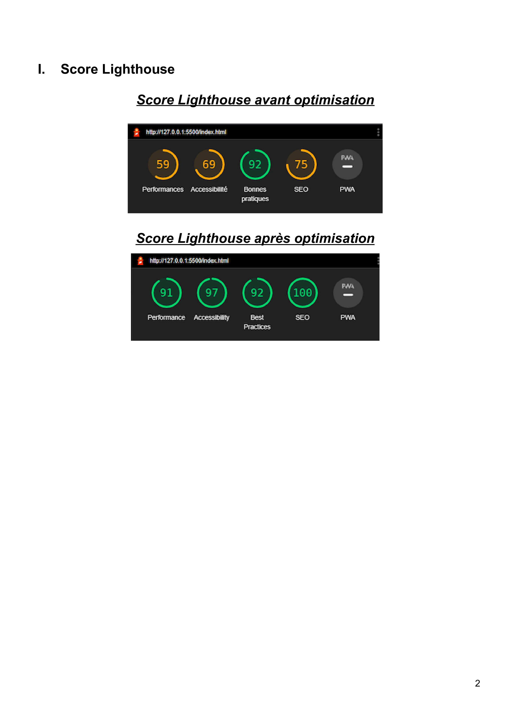
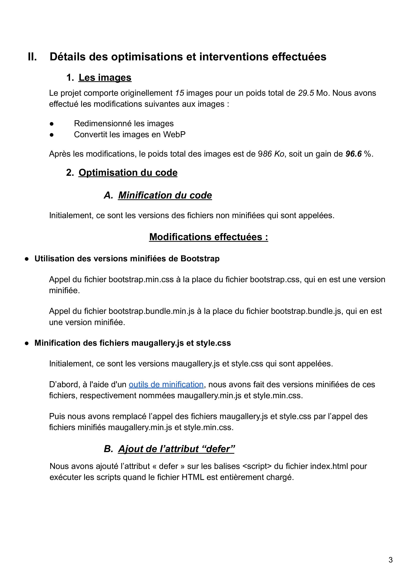
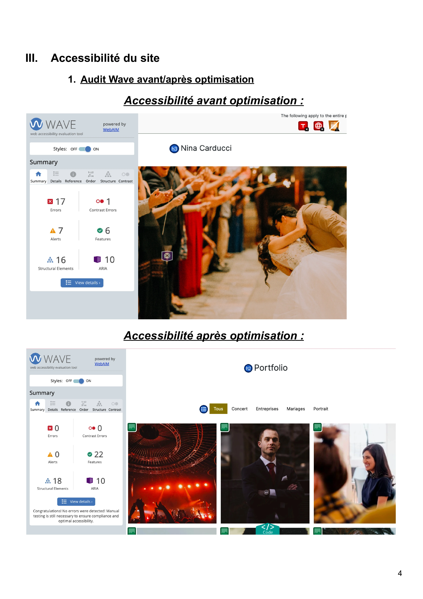
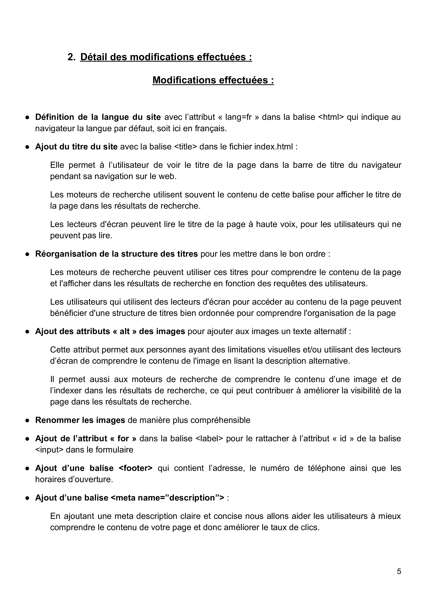
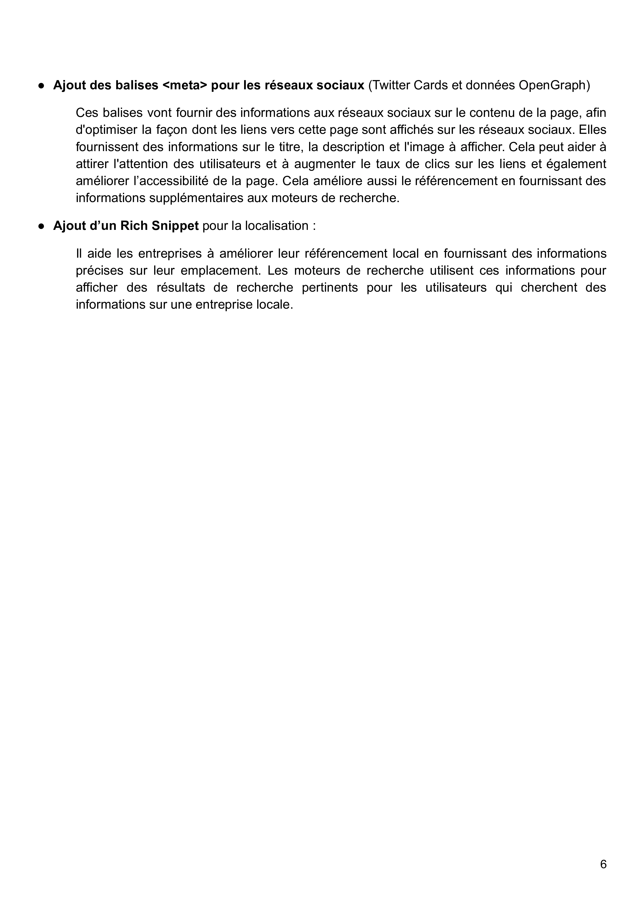
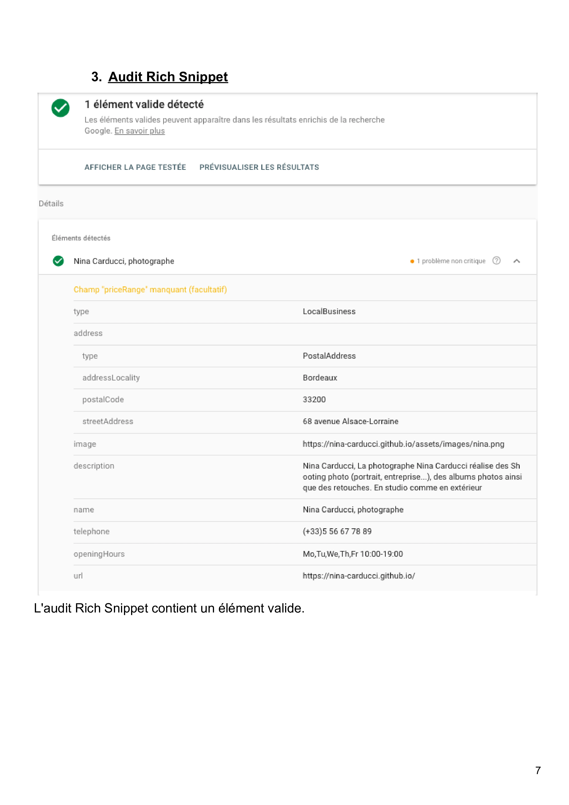
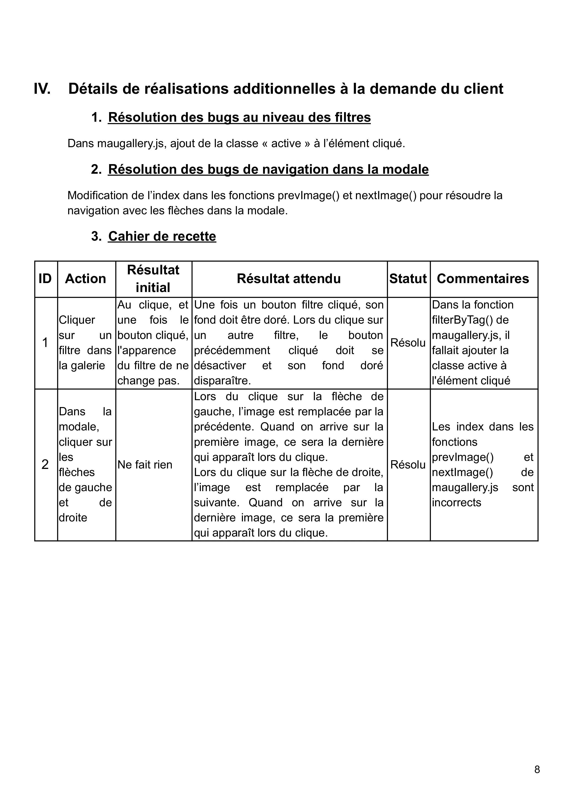

## Technologies

- HTML5
- CSS (Bootstrap)
- JAVASCRIPT (JQuery)

## Description

[Projet 5](https://openclassrooms.com/fr/paths/717/projects/1334/assignment) réalisé dans le cadre du programme de formation Développeur Web chez OpenClassrooms.

> Débugger et optimiser un site de photographe

### Contexte

Je suis développeuse freelance, et je décide de proposer mes services d’optimisation SEO à de nouveaux clients. Pour ce faire, j'ai analysé plusieurs sites internet. Parmi mes prospects, il y a le site de Nina Carducci, une photographe dont m'a parlé l’un de mes amis.Nina répond positivement à ma demande en me demandant une optimisation de son site. Je vais donc optimiser son site selon ses demandes indiquées dans son mail plus bas, et lui fournir un rapport détaillé de votre intervention.

> ### Compétences évaluées :
>
> - Optimiser les performances d’un site web
> - Débugger un site web grâce aux Chrome DevTools
> - Rédiger un cahier de recette pour tester un site

## Lancement du frontend

Telecharger l'extension Live Server sur Visual Studio Code.

Lancer le fichier index.html avec Live Server.

## Détail des fichiers

- Fichiers HTML:

    Le projet contient 1 fichier HTML.
    Le fichier index.html contient le code HTML du site.

- Fichier CSS:

    Il y a 2 fichiers CSS, le fichier style.css et le fichier bootstrap.css. Ces fichiers sont également présent en versions minifiées qui sont les fichiers appelés pour le CSS.

- Fichiers JS :

    Il y a 3 fichiers Javascript, le fichier scripts.js (JQuery) le fichier bootstrap.bundle.js et le fichier maugallery.js (jQuery). Pour ces deux derniers, c'est la version qui a été minifiée qui est appelée par index.html.

## Modification effectuées 

### Optimisations du site

- [x] Redimmensionnement des 15 images du site et conversion des images en format WebP
- [x] Minification des fichiers
- [x] Ajout de l'attribut defer sur les balises script

### Accessibilité et SEO du site

- [x] Ajout de l’attribut « lang=fr » dans la balise <html> 
- [x] Ajout de la balise <title> dans le fichier index.html
- [x] Réorganisation de la structure des titres 
- [x] Ajout des attributs « alt » aux images
- [x] Renommer les images de manière plus compréhensible
- [x] Ajout de l’attribut « for » dans la balise <label>
- [x] Ajout des balises sémantiques
- [x] Ajout d’une balise <meta name=”description”> 
- [x] Ajout des balises <meta> pour les réseaux sociaux (Twitter Cards et données OpenGraph) 
- [x] Ajout d’un Rich Snippet pour la localisation

## Sources

Pour ce projet, je me suis aidée : 
* des cours sur l'optimisation, l'accessibilité et le SEO d'un site web d'OpenClassRoom
* du guide des étapes clés
* du site https://fr.oncrawl.com/referencement/7-astuces-pour-optimiser-vos-images-facon-seo/ qui nous donne des astuces pour améliorer son SEO
* du site https://www.codeur.com/blog/conseils-referencement-local/ qui nous parle du référencement local
* du site https://www.skyminds.net/balises-meta-reseaux-sociaux-facebook-twitter-pinterest/ à propos des balises meta pour les réseaux sociaux
* du site https://www.ionos.fr/digitalguide/web-marketing/search-engine-marketing/google-lighthouse/ pour comprendre le fonctionnement de Google LightHouse

## Tests fonctionnels

- [x] cliquer sur les filtres pour voir le bon affichage des photos
- [x] cliquer sur un filtre pour voir si le bouton filtre activé à bien un fond doré
- [x] cliquer sur un autre filtre pour voir si le bouton filtre précédent se désactive et le fond se supprime
- [x] cliquer sur une photo de la gallery pour ouvrir la modale
- [x] cliquer sur la flèche de gauche pour afficher la précédente, quand on arrive sur la première image, la dernière doit apparaître lors du clique.
- [x] cliquer sur la flèche de droite pour afficher la suivante quand on arrive sur la dernière image, la première doit apparaître lors du clique.

## Rapport d'intervention

[Rapport complet de l’audit Lighthouse](https://www.calameo.com/read/007468495897e49762172)

## Auteur :

**Georgie Abreu** : [**GitHub**](https://github.com/AbreuGeorgie/)
